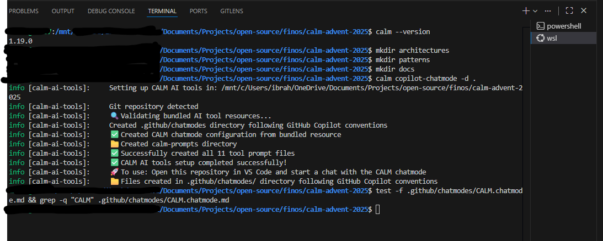

# Day-specific notes/challenge

## Setup and Pre-requistes Completed

- [x] Node.js (v20+) installed via `nvm`
- [x] CALM CLI installed (`npm install -g @finos/calm-cli`)
- [x] Git repo initialized & pushed to GitHub
- [x] `.github/chatmodes` configured for Copilot
- [x] Project folder structured with subfolders per day
- [x] Added .gitignore
- [x] Committed and tagged as day-1

---

## Notes

- Using **WSL on Windows** with **Ubuntu** for a clean Linux-based dev experience.
- Experimenting separately in `calm-engine-playground` repo to try out new things before using in daily challenges.

## ✅ Validation 

Below is the terminal output verifying Day 1 requirements:

