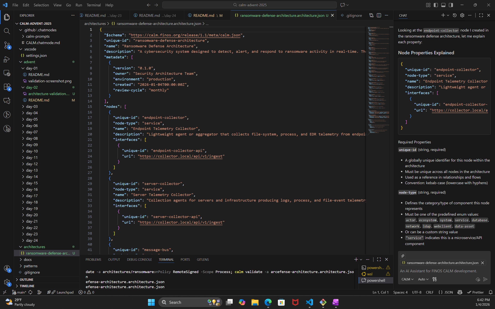
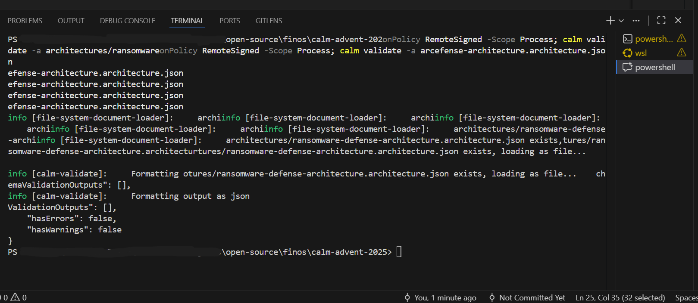

# 📅 Day 2: Define Initial Architecture and Create First Node

## ✅ Objectives

- Create a realistic system architecture using the CALM CLI
- Define the first node in your system
- Validate the generated architecture file

---

## Summary

Today’s goal was to move beyond setup and begin modeling a system. I chose to focus on a **Ransomware Defense Platform**, inspired by my ongoing work in cybersecurity. Using CALM CLI, I:

- Created a high-level system architecture file
- Defined a system named `ransomware-defense-platform`
- Added an initial node: `telemetry-collector` (responsible for collecting data on file system events, network behavior, etc.)
- Validated the architecture with `calm validate`

---

## ✅ Validation 

## Architecture JSON file explained by CALM AI Agent

## Node Properties Explained

{
  "unique-id": "endpoint-collector",
  "node-type": "service", 
  "name": "Endpoint Telemetry Collector",
  "description": "Lightweight agent or aggregator that collects file-system, process, and EDR telemetry from endpoints.",
  "interfaces": [
    {
      "unique-id": "endpoint-collector-api",
      "url": "https://collector.local/api/v1/ingest"
    }
  ]
}

## Required Properties
unique-id (string, required)

A globally unique identifier for this node within the architecture
Must be unique across all nodes in the architecture
Used as a reference in relationships and flows
Convention: kebab-case (lowercase with hyphens)
node-type (string, required)

Defines the category/type of component this node represents
Must be one of the predefined enum values: actor, ecosystem, system, service, database, network, ldap, webclient, data-asset
Or can be a custom string value
"service" indicates this is a microservice/API component
name (string, required)

Human-readable display name for the node
Should be descriptive and business-friendly
Used in documentation and visualizations
description (string, required)

Detailed explanation of what this node does
Should be comprehensive enough to understand the node's purpose
Critical for documentation generation
Optional Properties
interfaces (array, optional)

Array of communication endpoints this node exposes
Each interface defines how other nodes can interact with this node
Must follow CALM interface schema (either interface-definition or interface-type)
Interface Properties

## Interface Properties
unique-id (string, required in interface)

Unique identifier for this specific interface
Referenced in relationships when connecting nodes
url (string, optional)

Full URL endpoint for HTTP/HTTPS APIs
Alternative to host/port combination
Indicates this interface is accessible via web protocols

Schema Compliance Notes
Additional Properties: The node schema allows additional properties beyond the required ones ("additionalProperties": true)
Interface Flexibility: Interfaces can use either the modular interface-definition approach (with external schemas) or the flexible interface-type approach (shown here)

Validation: All properties must conform to the CALM v1.0 JSON schema for successful validation
This node represents a service that collects telemetry data, with a single HTTP API interface for ingesting data from endpoints.

